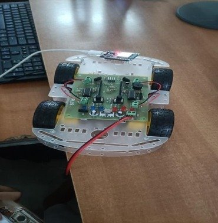

# Autonomous Ground Electric Vehicle (AGEV)

<p align="center">
  
</p>

<p align="center">
  <strong>ESP32-Based Autonomous Ground Vehicle for Intelligent Obstacle Detection and Navigation</strong>
</p>

<p align="center">
  
  
  
  
</p>

---

## Project Overview

AGEV (Autonomous Ground Electric Vehicle) is an ESP32-powered autonomous robotic rover designed to navigate environments intelligently using obstacle detection and real-time motor control.

The system demonstrates practical implementation of embedded systems, sensor integration, autonomous navigation logic, and robotics control. The project was developed as part of an Embedded Systems and IoT internship and serves as a foundation for future intelligent mobility and autonomous navigation systems.

---

## Project Prototype

<p align="center">
  
</p>

The AGEV prototype is built on a four-wheel rover platform and utilizes an ESP32 microcontroller as the primary processing unit. The rover continuously monitors its surroundings using ultrasonic sensing and autonomously adjusts its movement to avoid obstacles.

---

## Key Features

* Autonomous obstacle detection
* Real-time navigation decisions
* ESP32-based embedded control
* Differential drive system
* PWM motor speed control
* Expandable modular architecture
* Low-cost robotic platform
* Suitable for IoT and robotics research

---

## System Architecture

<p align="center">
  
</p>

### Core Components

| Component                 | Purpose                |
| ------------------------- | ---------------------- |
| ESP32 Development Board   | Main Processing Unit   |
| HC-SR04 Ultrasonic Sensor | Distance Measurement   |
| L298N Motor Driver        | Motor Control          |
| DC Motors                 | Vehicle Propulsion     |
| Chassis Platform          | Structural Support     |
| Battery Pack              | Power Supply           |
| GPS Module (Optional)     | Navigation Enhancement |
| LiDAR Module (Optional)   | Advanced Mapping       |

---

## Working Principle

The AGEV rover operates through a simple autonomous navigation workflow:

1. The ultrasonic sensor continuously scans the environment.
2. Distance measurements are transmitted to the ESP32 controller.
3. The embedded obstacle-detection algorithm evaluates nearby objects.
4. Movement decisions are generated in real time.
5. Motor control signals are sent to the L298N driver.
6. The rover proceeds forward or changes direction to avoid obstacles.

---

## Hardware Requirements

* ESP32 Development Board
* HC-SR04 Ultrasonic Sensor
* L298N Motor Driver
* 4 × DC Gear Motors
* Rover Chassis
* Rechargeable Battery Pack
* Jumper Wires
* Power Switch

---

## Software Requirements

* Arduino IDE
* ESP32 Board Package
* Required Arduino Libraries
* Serial Monitor for Debugging

---

## Firmware

Firmware source code is available at:

```text
firmware/firmware-agev.ino
```

### Upload Procedure

1. Install Arduino IDE.
2. Install ESP32 Board Support Package.
3. Connect the ESP32 via USB.
4. Open:

```text
firmware/firmware-agev.ino
```

5. Select the appropriate COM port.
6. Upload the firmware.
7. Open Serial Monitor for diagnostics.

---

## Repository Structure

```text
AGEV-Prototype
│
├── Assets
│   └── github-banner.png
│
├── Firmware
│   └── firmware-agev.ino
│
├── Media
│   ├── Rover.png
│   ├── Circuit-Design.png
│   └── demo_video.mp4
│
├── Docs
│   └─ Architecture.md
│
├── README.md
├── LICENSE.txt
└── Requirements.txt
```

---

## Demonstration

A project demonstration video is available in:

```text
Media/demo_video.mp4
```

You may also upload the video to GitHub Releases or YouTube and provide a direct demonstration link here.

---

## Future Scope

Potential enhancements include:

* LiDAR-based navigation
* GPS waypoint tracking
* Simultaneous Localization and Mapping (SLAM)
* Mobile application control
* Cloud-based telemetry dashboard
* Remote monitoring system
* AI-assisted path planning
* Autonomous mission execution

---

## Documentation

Additional project documentation is available under:

```text
Docs/
```

Included resources:

* Architecture Documentation
* Firmware Source Code
* Circuit Design Reference

---

## Skills Demonstrated

* Embedded Systems Design
* ESP32 Development
* Robotics Engineering
* Sensor Integration
* Motor Control Systems
* Autonomous Navigation
* IoT Prototyping
* Electronics Hardware Development
* Arduino Programming
* System Integration

---

## Author

### Vaishnavi Teja

Bachelor of Engineering (Electronics and Communication Engineering)

Areas of Interest:

* Embedded Systems
* Robotics
* Internet of Things (IoT)
* Autonomous Vehicles
* Edge AI

GitHub:

https://github.com/vaishnaviteja05

---

## License

This project is licensed under the MIT License.

